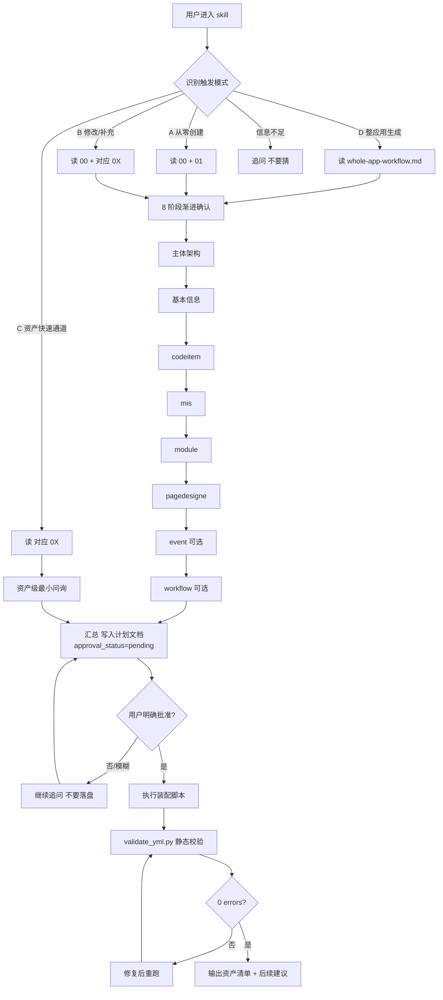

# Epoint Lowcode YAML Skill 设计文档

> 说明 skill **怎么运作**、**为什么这么设计**、**如何扩展**。
> 想知道"怎么用"请看 `SKILL.md`;想知道"字段怎么填"请看 `references/<asset>/<中文目录>/index.md`。

- 版本:对应 SKILL.md `v1.2.1`
- 适用工程:`lowcode-dsl-gen`(以及任何挂载本 skill 的 Epoint 低代码项目)
- 维护者:见 `SKILL.md` frontmatter `metadata.author`

---

## 1. 设计目标

把"自然语言需求 / PRD / 会议纪要"翻译成一套合规、可校验、可加载的 Epoint 低代码应用资产
(`META-INF/resources/.../` 下的 8 类 YAML)。

核心约束:

1. **不靠 LLM 凭直觉造字段**——所有字段都有白名单,LLM 只做"映射 + 装配",不做"发明"。
2. **不绕过用户批准**——批准前一行应用资产都不写。
3. **跨 IDE / CLI 通用**——Codex / Claude Code / Windsurf / Cursor / Cline / Trae / Kiro 等宿主上行为一致。
4. **可机器校验**——所有产物落盘后必须能被 `validate_yml.py` 静态扫描通过(0 errors)。

---

## 2. 总体架构

```
┌─────────────────────────────────────────────────────────────────────────┐
│                          用户(自然语言对话)                             │
└──────────────────────────────┬──────────────────────────────────────────┘
                               ▼
┌─────────────────────────────────────────────────────────────────────────┐
│  ① Skill 入口(SKILL.md frontmatter)                                    │
│  description 触发词 + Role 角色定位                                      │
└──────────────────────────────┬──────────────────────────────────────────┘
                               ▼
┌─────────────────────────────────────────────────────────────────────────┐
│  ② 决策层(SKILL.md 正文)                                               │
│  · 4 种触发模式判定(A 从零 / B 修改 / C 资产快速 / D 整应用)             │
│  · 8 阶段渐进确认(主体架构 → 基本信息 → ... → 工作流 → 最终批准)        │
│  · 计划文档门禁(.lowcode-plans/<apptag>-plan.md)                       │
└──────────────────────────────┬──────────────────────────────────────────┘
                               ▼
┌─────────────────────────────────────────────────────────────────────────┐
│  ③ 知识层(references/)                                                 │
│  · 00 目录结构 / 99 公共约定                                             │
│  · 01-08 各类资产字段白名单与示例                                        │
│  · 09 整应用工作流                                                       │
│  · event/ 与 pagedesigne/ 子目录:复杂场景的细化文档与示例                │
└──────────────────────────────┬──────────────────────────────────────────┘
                               ▼
┌─────────────────────────────────────────────────────────────────────────┐
│  ④ 装配层(scripts/)                                                    │
│  · path_resolver.py:apptag → 应用根目录绝对路径                         │
│  · scaffold_app.py / add_*.py:7 个资产装配脚本                         │
│  · _common.py:共享工具(parse_json_arg / UUIDv4 / 模板渲染等)          │
│  · 模板:assets/templates/<type>.yml 提供占位符骨架                     │
└──────────────────────────────┬──────────────────────────────────────────┘
                               ▼
┌─────────────────────────────────────────────────────────────────────────┐
│  ⑤ 校验层                                                                │
│  · validate_yml.py:静态结构 + 引用闭合 + 红线规则                       │
│  · check_dsl.py:动作流 DSL 节点 / 连线 / 资产校验                       │
│  · inventory_metadata.py:整应用资产清单                                 │
└──────────────────────────────┬──────────────────────────────────────────┘
                               ▼
┌─────────────────────────────────────────────────────────────────────────┐
│  ⑥ 落盘                                                                  │
│  <apptag>/<appinfo|appref|codeitem|mis|module|event|workflow|pagedesigne>│
└─────────────────────────────────────────────────────────────────────────┘
```

各层职责互斥,不交叉:
- **决策层**只做"问什么 / 何时落盘",不查字段定义。
- **知识层**只回答"这个字段怎么填",不做生成。
- **装配层**只做"模板 + 占位符 → yml/json",不做问询。
- **校验层**只做"静态扫描",不修复(由 LLM 或人工修复后重跑)。

---

## 3. 核心运作流程

### 3.1 整体流程图



### 3.2 4 种触发模式

| 模式 | 触发信号 | 第一步读哪个 references | 典型对话起点 |
|------|---------|------------------------|------------|
| **A 从零创建** | "新建 / 创建一个应用",且工程里没有对应 apptag 目录 | `directory-structure.md` + `appinfo/应用配置/index.md` | 问应用标识、开发商标识、应用中文名 |
| **B 修改/补充** | 已存在 apptag,要在已有应用根目录里追加 | `00` + 对应 `<asset>/<中文目录>/index.md` | 先 `inventory_metadata.py` 列资产清单 |
| **C 资产级快速** | "加一个代码项 / 动作流 / 数据表..." 且能从语境识别 apptag | 对应 `<asset>/<中文目录>/index.md` | 跳过应用层问询,直接进资产层 |
| **D 整应用生成** | 用户给 PRD / 会议纪要 / 自然语言描述完整应用 | `whole-app-workflow.md` | 走 8 阶段全流程 |

### 3.3 8 阶段渐进确认

固定顺序,**当前阶段未确认前不提前问后续阶段**:

```
主体架构 → 基本信息 → codeitem → mis → module → pagedesigne → workflow → event → 最终批准
```

每阶段:
- 最多 3 个问题
- 优先问业务含义,再映射底层字段
- 给"建议值"但不当作已确认事实
- 阶段结束输出短摘要再进下一阶段

> workflow / event 是**条件阶段**:用户没明确要求时不进入,目录留空。

### 3.4 计划文档门禁

唯一硬约束。机制如下:

```
 批准前   ──→  只能写 .lowcode-plans/<apptag>-plan.md(其它一律拒写)
                          │
                          │ 计划文档必含 11 个字段:
                          │   tool_name / current_stage / confirmed_stages
                          │   pending_stages / next_question
                          │   approval_status(默认 pending)
                          │   approval_text(默认空)
                          │   应用根目录 / 资产清单 / 脚本命令 / 校验命令
                          ▼
 用户明确批准 ──→ approval_status=approved + 记录原文 ──→ 解锁应用资产写入 + 脚本调用
```

**批准 = 用户明确语义**("批准创建 / 按计划生成 / 可以落盘")。
模糊回复("嗯"、"好像可以"、"你看着办")**一律不算批准**,继续追问。

非交互模式(`codex exec` / CI):停在生成计划文档这一步,回报"等待人工批准"。

---

## 4. 资产类型与脚本对应表

| 资产 | 资产子目录 | 第一行 type | 主脚本 | references 入口 | 模板 |
|------|---------------|-----------|--------|----------|------|
| appinfo | `<apptag>/` | (无) | `scaffold_app.py` | `appinfo/应用配置/index.md` | `appinfo.lowcode.yml` |
| appref | `<apptag>/` | (无) | `scaffold_app.py` | `appref/引用配置/index.md` | `appref.lowcode.yml` |
| codeitem | `codeitem/` | `codeitem` | `add_codeitem.py` | `codeitem/代码项/index.md` | `codeitem.yml` |
| mis | `mis/` | `mis` | `add_mis_field.py` | `mis/数据模型/index.md` | `mis.yml` |
| module | `module/` | `module` | `add_module.py` | `module/模块/index.md` | `module.yml` |
| event(动作流) | `event/` | `event` | `add_event.py` | `event/动作流/index.md` + 子目录 | `event.yml` |
| workflow(审批流) | `workflow/` | `workflow` | `add_workflow.py` | `workflow/工作流/index.md` + 子目录 | `workflow.yml` |
| pagedesigne | `pagedesigne/` | yml（内容仍为 JSON 文本） | `add_pagedesigne.py` | `pagedesigne/页面设计器/index.md` + 子目录 | `pagedesigne.yml` |

> 工作流自身是**最复杂**的资产:5 类节点 + 9 个核心子表(activity / transition / workflowConfig / workflowPvMaterial / workflowPvMisTableSet / method / workflowEvent / workflowContext / workflowProcessVersion)。

---

## 5. 工作流资产专项设计(最复杂的资产)

### 5.1 5 类节点拓扑

```
         ┌────────┐
         │ 浏览(100)│  ← 孤立节点,不参与流转,位置置于流程上方
         └────────┘

  ┌────┐    ┌────┐    ┌──────┐    ┌──────┐    ┌────┐
  │开始│ →→ │申请│ →→ │审批 1│ →→ │审批 N│ →→ │结束│
  └────┘    └────┘    └──────┘    └──────┘    └────┘
   (10)     (30)       (30)         (30)        (20)
  vmlid=-1  vmlid=2    vmlid=3      vmlid=N+2   vmlid=1
```

**红线**(违反必引擎拒绝):
1. 开始(10)与申请(30)**必须分拆**为两个独立 activity
2. 5 类节点缺一不可
3. 节点名称固定:`开始` / `申请` / `结束`(浏览/审批可自定义)
4. 开始/结束/浏览节点的 `handleurl`(浏览除外) / `multitransactormode` / `timelimitenable` / `earlywarning_enable` / `isallowaddattachfile` / `isPassWhenNoTransactor` 必须为 `null`
5. transition 必须形成 `开始 → 申请 → 审批 → ... → 结束` 链路,不能跳过申请节点
6. 退回按钮(`operationtype=30`)与 `workflowConfig` 1:1 对应
7. 所有子节点 `processversionguid` **完全一致**

### 5.2 工作流扩展能力(可选项)

按需启用,基础骨架不引入:

| 工作流字段（工作流扩展） | 用途 | 关键引用关系 |
|---------|------|------------|
| `method` + `workflowMethodParameter` | 流程外部 Java 方法 | 被 `workflowEvent.eventMethodGuid` / `workflowTransitionCondition.methodGuid` 引用 |
| `workflowEvent` | 活动实例 / 操作前后挂事件 | `eventMethodGuid` → method;`sourceGuid` → activity 或 operation |
| `workflowContext` | 把表单字段提成流程参数 | `fromMaterialGuid` → workflowPvMaterial;参数名可在 `[#=参数#]` 中引用 |
| `workflowTransitionCondition` | transition 上挂条件分支 | `transitionGuid` → 所属 transition;条件可引用 workflowContext 参数 |
| `workflowProcessVersion.revoke*` | 发起人撤销策略 | 单字段 |

校验闭环已在 `validate_yml.py` 的 `validate_workflow()` 函数中实现（含字段类型校验 + 工作流扩展值域校验）。

### 5.3 5 条强制重点检查

每次工作流生成前后必走(详细见 `references/workflow/工作流/index.md` 顶部)。
生成前还须核对 `references/workflow/工作流/生成与校验/07-字段类型约束表.md`，防止数字/字符串类型错误。

1. yaml 文件结构正确及完整性
2. 各节点结构完整性(必填项 / 必空字段)
3. 各节点间的关联关系正确性(processversionguid 一致 / GUID 引用闭合)
4. 设计红线、节点拆分关联强规则
5. 必须通过 `validate_yml.py` 引擎运行校验(0 errors)

---

## 6. 校验体系

```
┌────────────────────────────────────────────────────────────┐
│  validate_yml.py(主校验器)                               │
├────────────────────────────────────────────────────────────┤
│  · 单文件:python validate_yml.py <file>                    │
│  · 整应用:python validate_yml.py --strict --check-refs <app-root> │
│                                                              │
│  校验项分类:                                                  │
│  ① 结构层    type 标识、顶层包装、必有子节点                 │
│  ② 字段层    必填项、枚举值、类型、字符串/数字陷阱            │
│  ③ 关联层    processversionguid 一致、GUID 引用闭合         │
│  ④ 红线层    节点拆分、5 节点齐全、空值规则、流转闭环         │
│  ⑤ 工作流扩展层     method / event / context / condition 引用闭合 │
└────────────────────────────────────────────────────────────┘

┌────────────────────────────────────────────────────────────┐
│  check_dsl.py(动作流专项)                                 │
├────────────────────────────────────────────────────────────┤
│  · 节点类型完备性                                            │
│  · 连线源/目标可达性                                         │
│  · 资产引用(数据源 / 接口 / codeitem)                      │
└────────────────────────────────────────────────────────────┘

┌────────────────────────────────────────────────────────────┐
│  inventory_metadata.py(资产盘点)                          │
├────────────────────────────────────────────────────────────┤
│  · 列出应用根下所有 yml/json                            │
│  · 标注 type / 文件名 / 关键标识                             │
│  · 用于"修改 B 模式"的清单展示                               │
└────────────────────────────────────────────────────────────┘
```

校验结果分级:
- `error`:必须修复后才算交付
- `warn`:建议处理,影响功能但不阻塞引擎加载

---

## 7. 二次开发指南

### 7.1 新增一类资产(假设要加 "report" 报表 yml)

按以下顺序改动,每步独立可测:

1. **白名单文档**:写 `references/<report>/<报表>/index.md`（按新目录规范），完整列字段、枚举、示例
2. **模板**:写 `assets/templates/report.yml`,用 `{{PLACEHOLDER}}` 占位
3. **装配脚本**:写 `scripts/add_report.py`,套用 `add_module.py` 模式:
   - 用 `_common.parse_json_arg` 解析 `--xxx-json` 入参
   - 用 `path_resolver.py` 算应用根目录绝对路径
   - 用 UUIDv4 生成 GUID
   - 写盘前校验关键信息齐全(缺信息 → fail-fast,除非 `--allow-empty`)
4. **校验扩展**:在 `validate_yml.py` 加 `_validate_report(...)` 函数,处理 `type: report` 文件
5. **SKILL 索引**:在 `SKILL.md` 的"References 索引"和"内置脚本一览"加新行
6. **触发模式**:如果 report 触发词独立(如"报表 / 数据看板"),在 description 加关键词
7. **整应用阶段**:决定要不要把 report 加到 8 阶段顺序里(默认不加,作为可选阶段)

### 7.2 新增工作流字段(假设规范文档新增 `urgentLevel`)

1. **规范对齐**:确认字段在 `Epoint工作流YAML定义规范.md` 中的字段表里
2. **references**:在 `references/workflow/工作流/index.md` 对应章节加字段行 + 取值表 + 示例
3. **模板**:在 `assets/templates/workflow.yml` 加字段(必填项写默认值,可选项注释掉)
4. **脚本**:`add_workflow.py` 中如果是必填,需要新增 CLI 参数或默认值
5. **校验**:`validate_yml.py` 中如果有枚举约束,加 `_validate_workflow_field(...)`
6. **测试**:在 `evals/evals.json` 加一组测试样本(如未建议 evals 目录,可手测)

### 7.3 新增校验规则

修改 `validate_yml.py`:
- `result.err(path, message)` 阻塞错误
- `result.warn(path, message)` 警告
- 如果是跨文件引用(如 mis ↔ codeitem),加到 `--check-refs` 路径

### 7.4 新增触发模式

通常不需要(已覆盖 4 种)。如果业务确实需要(如"导出整应用"),改 `SKILL.md` 的"4 种触发模式速查"表 + "References 索引"对应行,并提供主入口脚本。

---

## 8. 关键约定与陷阱

### 8.1 开发约定(写脚本必读)

1. **JSON 入参全部用 `parse_json_arg`** —— `_common.parse_json_arg(value, expected_type=list, label=...)`,否则字符串会被当 list 逐字符遍历
2. **路径用绝对路径** —— 调脚本前先 `path_resolver.py --apptag <tag>` 算路径
3. **缺信息 fail-fast** —— 不要默默用空值;`--allow-empty` 是逃生舱,LLM 不主动用
4. **GUID 用 UUIDv4** —— 不让 LLM 编 GUID
5. **type 第一行不能省** —— 渲染器二次校验依据
6. **iconx/icony/direction/tag 用字符串** —— 数字会渲染异常（详见 `references/workflow/工作流/生成与校验/07-字段类型约束表.md`）
7. **tableid 用整数** —— `workflowPvMisTableSet.tableid` 必须为整数，不能写成字符串（如 `'car_apply'`）
8. **device 默认 desktop** —— 仅当用户明确说"移动端 / 小屏 / H5"才切 mobile

### 8.2 LLM 行为陷阱

| 陷阱 | 错误示范 | 正确做法 |
|------|---------|---------|
| 试图用 y/n 确认 | "可以创建吗?Y/N" | 用编号选项;批准必须明确语义 |
| 模糊回复当批准 | 用户"嗯",LLM 开始落盘 | "嗯"不算批准,继续追问 |
| 默认值替用户决定 | "我用默认值生成了" | 默认值只作建议,关键字段必须用户确认 |
| 一上来就读全部 references | 第一轮读 5000+ 行 | 按"用户意图 → 必读文档"表查 |
| 凭直觉造字段 | 编一个 references 没列的字段 | 查不到先问用户 |
| 错误重试无限循环 | 同一脚本失败 5 次还在调参 | 失败 3 次立即停,回报根因 |
| 绕过校验直接说"完成" | 校验有 error 但回报成功 | 0 errors 才算完成 |

---

## 9. 当前不在范围内的场景

- **状态机型工作流**(含 `statemachinetag` / `statusid`):复杂,建议线上设计器画
- **加办 / 抄送 / 送阅读** 等高级流程操作:手写难度大
- **流程脚本 / 外部方法 Java 实现**:属高码资产,参考 `epoint-framework-dev`
- **非 Vue 流程**(`isvue=0`):本 skill 默认生成 Vue 流程(`isvue=1`),非 Vue 流程仅作兼容支持,不再默认生成
- **复杂条件分支**(多条件 + 嵌套):简单单条件可手写 `workflowTransitionCondition`,复杂的用线上设计器
- **`workflowActivityMaterial` / `workflowActivityFieldAccess`**:规范文档列出但字段定义"待补充",当前不生成

---

## 10. 文件清单速查

```
lowcode-dsl-gen/
├── SKILL.md                              ← skill 主入口(LLM 进入时读)
├── SKILL-DESIGN.md                       ← 本文档(二开者读)
├── README.md                             ← 项目说明
├── Epoint工作流YAML定义规范.md             ← 工作流字段定义权威文档
├── assets/
│   └── templates/                        ← 资产模板(占位符骨架)
│       ├── appinfo.lowcode.yml
│       ├── appref.lowcode.yml
│       ├── codeitem.yml
│       ├── mis.yml
│       ├── module.yml
│       ├── event.yml
│       ├── workflow.yml
│       └── pagedesigne.yml
├── references/                           ← 字段白名单 + 详细说明
│   ├── directory-structure.md         ← 目录结构 / 脚本 cheatsheet / 触发模式细节
│   ├── whole-app-workflow.md          ← 整应用 D 模式工作流
│   ├── conventions.md                 ← 通用约定 / 字段填充准则
│   ├── appinfo/应用配置/index.md          ← 单文件承接（R6.3 例外）
│   ├── appref/引用配置/index.md           ← 单文件承接（R6.3 例外）
│   ├── codeitem/代码项/index.md
│   ├── mis/数据模型/index.md
│   ├── module/模块/index.md
│   ├── event/动作流/                     ← index.md + 基础结构/ + 节点/ + 场景示例/ + 工具说明/ + 学习指南/ + 检查清单/ + 常见错误/
│   ├── workflow/工作流/                  ← index.md + 基础骨架/(01~06) + 生成与校验/(01~07) + 场景示例/
│   └── pagedesigne/页面设计器/           ← index.md + Schema 字段速查.md + 视图模型速查.md + 设计器 Schema 规范定义/(01~08 + 示例/)
├── scripts/                              ← 装配 + 校验工具
│   ├── _common.py                        ← 共享:parse_json_arg / UUIDv4 / 模板渲染
│   ├── path_resolver.py                  ← apptag → 应用根目录绝对路径
│   ├── scaffold_app.py                   ← 新建应用骨架
│   ├── add_codeitem.py
│   ├── add_mis_field.py
│   ├── add_module.py
│   ├── add_event.py
│   ├── add_workflow.py                   ← 一键生成工作流(5 节点骨架)
│   ├── add_pagedesigne.py
│   ├── inventory_metadata.py             ← 资产清单
│   ├── validate_yml.py                   ← 主校验器(结构 + 引用 + 红线)
│   └── check_dsl.py                      ← 动作流 DSL 专项校验
├── evals/                                ← 测试样本(用于 LLM 回归)
│   └── evals.json
└── .lowcode-plans/                       ← 运行时生成的计划文档(批准前唯一可写区)
    └── <apptag>-plan.md
```

---

## 11. 相关文档与延伸阅读

- 字段权威定义:`Epoint工作流YAML定义规范.md`
- 用户手册:`SKILL.md`
- 生成前重点检查:`references/workflow/工作流/index.md` 顶部"🔍 生成前重点检查清单"
- 字段类型约束:`references/workflow/工作流/生成与校验/07-字段类型约束表.md`
- 工作流节点详细定义:`references/workflow/工作流/基础骨架/` 子文档
- 外部方法 / 事件配置 / 相关数据 / 流转条件:见 `references/workflow/工作流/基础骨架/`
- 通用约定:`references/conventions.md`
- 触发模式细节:`references/directory-structure.md` 的"触发模式细节"节
- 整应用工作流:`references/whole-app-workflow.md`

---

## 12. 变更与维护

修改 SKILL 时遵循:
1. 先改对应 `references/<asset>/<中文目录>/index.md`（权威白名单）
2. 再改 `assets/templates/<type>.yml`(模板)
3. 再改 `scripts/add_*.py`(装配)
4. 再改 `scripts/validate_yml.py`(校验)
5. 最后回到 `SKILL.md`(更新索引 / 关键词)
6. 同步更新 `SKILL-DESIGN.md`(本文档)

每次发布前:
- 跑 `python scripts/validate_yml.py --strict --check-refs <一组测试应用根目录>`
- 跑 `evals/` 下样本回归
- 更新 `SKILL.md` frontmatter 的 `metadata.version`

---

## 13. v1.2.1 变更纪要

本次同步规范文档 `Epoint工作流YAML定义规范.md` 的修复项:

### 字段命名规范化(template + 脚本 + references)
- transition 字段命名统一为下划线:`isTargetTransactorEditable` → `is_targettransactor_editable`、`isShowAsOperationButton` → `is_showasoperationbutton`
- `assets/templates/workflow.yml` 与 `scripts/add_workflow.py` 的 transition 字段全部更新

### 按钮 工作流按钮必填字段(template + 脚本 + references)
- 引擎层视为必填的 `is_ShowOpinionTemplete=0` 与 `ordernumber` 现已在模板和 `add_workflow.py` 默认输出
- 通过按钮默认 `stateLevel=10`(主按钮蓝色)、退回按钮默认 `stateLevel=30`(危险红色) + `ordernumber=1`
- `references/workflow/工作流/index.md` 补充"按钮字段完整示例"章节(主按钮 + 退回按钮各一份)

### 工作流字段（工作流扩展）示例(template)
- `assets/templates/workflow.yml` 中 `workflowContext` / `method` / `workflowEvent` 三个工作流字段（工作流扩展）的注释占位替换为真实业务示例(金额条件分支 / 更新业务表状态方法 / 操作后事件钩子)

### 校验增强(`scripts/validate_yml.py`)
- 新增:退回按钮 `multiTransctorMode` 枚举校验,值必须在 `{OR, AND, OrAndRead}` 集合内,否则 error
- 新增:transition 字段命名旧驼峰检测,发现 `isTargetTransactorEditable` / `isShowAsOperationButton` 报 warn 强制改

### 文档精简(SKILL.md + references/workflow/工作流/index.md)
- SKILL.md 去重"提效要点 10 条" → 精简为"LLM 自检要点 6 条"(去掉与上文规则重复的 5 条,新增"工作流字段命名"约束)
- SKILL.md 合并冗余的 Plan Mode 提示段、PC/移动端 demo 索引行
- SKILL.md "工作流硬性要求"压成引用版,不再复述 5 条检查
- references/workflow/工作流/index.md 把"校验规则"和"常见错误"两张表合并为"校验规则与修复指引"一张表
- references/workflow/工作流/index.md 末尾"快速生成脚本"压缩,只保留入口指向

### 已知未修(等规范文档作者修)
规范文档 `Epoint工作流YAML定义规范.md` 自身的 3 处笔误暂未动:
1. "五、快速生成模板"开始节点写成 `vmlid: 1`、结束节点 `vmlid: -1`,与 3.2.1 字段定义矛盾
2. "4.2 一对多关系"transition 数量"活动数 -1"应为 -2(浏览节点不参与流转)
3. 3.2.8 `workflowTransitionCondition` 标"必填"但说明"≥0 个",语义冲突

---

## 14. v1.2.2 变更纪要

本次针对工作流 Skills 进行调优与问题修复，覆盖 5 个阶段：

### 字段类型 Bug 修复（`add_workflow.py` + `validate_yml.py`）
- **`--table-id` 强制整数**：argparse 增加 `type=int`，防止传入字符串（如 `car_apply`）
- **`tableid` 赋值修正**：`args.table_id if args.table_id is not None else ""`，不再用 `or ""` 导致 0 被错误替换
- **`workflowProcessVersion` 扩展字段补全**：`add_workflow.py` 默认生成 `revokeOption`/`revokeAllowDay`/`revokeRemindOption`/`noParticipatorOption`/`isShowLineGraph`/`isShowNodeSimple`
- **全面字段类型校验**：`validate_yml.py` 新增 112 行校验代码，覆盖 `tableid`(error)、`iconx/icony`(warn)、`multitransactormode` 等(warn)、`direction/tag`(warn)、工作流扩展值域(warn)、transition 整数字段(warn)、operation 字符串字段(warn)

### workflow references 文档重构
- 删除 `references/workflow/` 下 5 个英文命名旧文件（`01-requirement-recognition.md` 等），迁移到中文子文件夹
- 新建 4 个子文件夹 + 16 个中文子文档：
  - `基础骨架/`：01-流程节点、02-活动按钮、03-流转关系、04-表单材料与数据表、05-流程版本
  - `工作流扩展节点/`：01-外部方法、02-事件配置、03-相关数据、04-流转条件（注：本次重构后此目录已取消，内容并入 基础骨架/，见 2025-05-21 条目）
  - `生成与校验/`：01~05 生成流程指南、06-脚本使用指南（新建）、07-字段类型约束表（新建）
  - `场景示例/`：01-简单审批流（含完整可运行 YAML 带类型注释）
- `07-workflow.md` 改写为索引文档：保留检查清单/红线/顶层结构/数据关系/校验规则，新增文档导航表
- 2025-05-21 进一步重构：取消版本维度切分，统一合并入 workflow 基础骨架。

### dsl-gen-api 同步
- `references/event/动作流/index.md` 第 540-541 行：`app.code → app.sign`（SKILL.md 已声明 code 废弃）

### SKILL.md 索引更新
- References 索引表新增 4 行：workflow 深度/工作流扩展/字段类型约束/生成指南
- 工作流硬性要求新增第 6 条：字段类型务必核对约束表
- 2025-05-21 索引更新：0X-*.md 索引行全部替换为 `<asset>/<中文目录>/index.md`，删除版本区分行，event 行合并为单行。

### 验证结果
- `validate_yml.py` 成功检出 `用车申请审批流程.workflow.yml` 的 `tableid: car_apply` 类型错误
- `add_workflow.py --help` 确认 `--table-id` 已为 int 类型
- Python 语法检查通过
- 目录结构验证：22 个子文档全部就位，旧英文文件已删除
