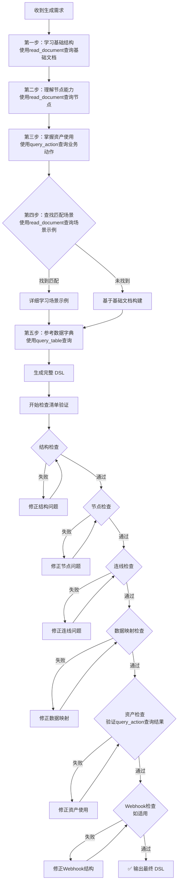

# 六大检查清单

**生成 DSL 后必须按顺序逐项检查，每一项检查通过后才能进行下一项。**

> 本文档从 `event/动作流/index.md` 拆分而来，便于按需加载。

---

## 🎯 完整生成流程



---

## ✅ 生成检查清单（必须执行）

**⚠️ 警告**：生成 DSL 后，**必须按顺序逐项检查**，每一项检查通过后才能进行下一项：

### 第一项：结构检查

**检查目标**：验证 YAML 文件的整体结构是否符合规范。

| 检查项 | 检查内容 | 如何检查 | 失败后的操作 |
|-------|---------|---------|-------------|
| ✓ | YAML 文件以 `---` 开头 | 查看文件第一行 | 在文件开头添加 `---` |
| ✓ | **顶层结构顺序正确** | **检查顶层是否依次为：`app` → `workflow` → `kind` → `version` → `dependencies`** | **重新组织文件结构，确保 `app` 在 `workflow` 之前**（这是关键！） |
| ✓ | **app.id 已配置** | **检查 `app` 节点下是否有 `id` 字段（UUID格式）** | **生成UUID并添加 `id` 字段** |
| ✓ | **app.id 唯一性** | **检查 `app.id` 是否与其他动作流重复** | **生成新的UUID** |
| ✓ | **app.sign 已配置** | **检查 `app` 节点下是否有 `sign` 字段（name的拼音标识）** | **生成拼音并添加 `sign` 字段** |
| ✓ | **app.sign 唯一性** | **检查 `app.sign` 是否与其他动作流重复** | **修改为唯一的标识** |
| ✓ | **app.created_at 已配置** | **检查 `app` 节点下是否有 `created_at` 字段（秒级时间戳）** | **生成时间戳并添加 `created_at` 字段** |
| ✓ | `kind: "app"` 在文件末尾 | 查看文件倒数几行 | 将 `kind` 移至文件末尾 |
| ✓ | `version: "3.0"` 在文件末尾 | 查看文件倒数几行 | 将 `version` 移至文件末尾 |
| ✓ | `dependencies: []` 在最后 | 查看文件最后一行 | 在 `version` 后添加 `dependencies: []` |
| ✓ | 字段嵌套层次正确 | 对比基础结构文档 | 调整字段层次，确保 `app`、`workflow`、`graph` 等层级正确 |
| ✓ | **workflow包含conversation_variables** | **检查`workflow`节点下是否有`conversation_variables: []`字段（必须在第一位）** | **在`workflow`节点下第一行添加`conversation_variables: []`** |
| ✓ | **workflow包含environment_variables** | **检查`workflow`节点下是否有`environment_variables: []`字段（必须在第二位，conversation_variables之后）** | **在`workflow`节点下第二行添加`environment_variables: []`** |
| ✓ | 所有必需字段已填写 | 逐个检查 `app.mode`、`app.name`、`workflow.graph` 等 | 补充缺失字段 |

**通过标准**：所有检查项均为 ✓，无任何结构性错误。

---

### 第二项：节点检查

**检查目标**：验证所有节点的定义是否完整和正确。

| 检查项 | 检查内容 | 如何检查 | 失败后的操作 |
|-------|---------|---------|-------------|
| ✓ | 所有节点 `id` 唯一 | 遍历 `workflow.graph.nodes`，检查 `id` 是否重复 | 为重复的节点生成新的唯一 `id` |
| ✓ | 节点有必需字段 | 检查每个节点是否有 `id`、`type`、`data`、`position` 字段 | 补充缺失字段 |
| ✓ | 开始节点无入站连线 | 检查 `data.type: "start"` 的节点，确保它不是任何 edge 的 `target` | 删除指向开始节点的多余连线 |
| ✓ | 结束节点无出站连线 | 检查 `data.type: "end-vue"` 的节点，确保它不是任何 edge 的 `source` | 删除从结束节点出发的多余连线 |
| ✓ | 其他节点有入站和出站 | 检查每个非开始/结束节点，确保它既是某个 edge 的 `target`，也是某个 edge 的 `source` | 添加缺失的连线 |
| ✓ | 条件节点所有分支有连线 | 检查 `data.type: "if-else"` 的节点，确保有 `sourceHandle: "true"` 和 `"false"` 的连线 | 添加缺失分支的连线 |
| ✓ | 条件节点字段顺序正确 | 检查条件节点的 `data` 下是否先定义 `cases`，后定义 `type`、`title`、`selected`、`desc` | 调整字段顺序，**将 `cases` 移到最前面** |
| ✓ | 条件节点cases配置完整 | 检查条件节点的 `cases[0]` 是否包含 `id: "true"` 和 `case_id: "true"` 字段 | 添加缺失的 `id` 字段，值为 `"true"` |
| ✓ | 条件节点conditions配置完整 | 检查条件节点的每个 `conditions[i]` 是否包含 `id`（UUID格式）和 `value`（字符串，可为空 `""`） | 补充 `id` 字段（UUID）和 `value` 字段（空字符串 `""`） |
| ✓ | 业务动作节点category固定值 | 检查 `data.type: "biz-action"` 的节点，`actionData.category` 必须为 `biz_action` | 将 `actionData.category` 修正为 `biz_action` |
| ✓ | 迭代节点有双层连线 | 检查 `data.type: "iteration"` 的节点，确保有到后续节点的连线，且其内部的 `iteration-start` 节点有到首个子节点的连线 | 添加缺失的双层连线 |
| ✓ | 迭代内节点设置 isInIteration | 检查迭代循环内的所有节点（除迭代开始节点外），确保 `data.isInIteration` 被设置为 `true` | 为所有迭代内节点添加 `isInIteration: true` |
| ✓ | **⚠️ 迭代内节点设置 iteration_id（高频错误）** | **检查迭代循环内的所有节点（除迭代开始节点外），确保 `data.iteration_id` 被设置为迭代节点ID。这是最容易遗漏的配置，缺失会导致导入报错** | **为所有迭代内节点在data层级添加 `iteration_id: "迭代节点ID"`（与isInIteration同级）** |
| ✓ | **⚠️ 迭代内节点的 `parentId` 配置（高频错误）** | **检查迭代循环内的所有业务节点，确保 `parentId` 指向迭代节点本身（如 `"node_iteration_lineitem"`），而不是迭代开始节点（如 `"node_iteration_lineitem_start"`）。迭代开始节点只是视觉标记节点，不能作为父容器。这是常见配置错误，会导致流程图显示异常** | **修正 `parentId` 指向迭代节点ID（去掉 `_start` 后缀）** |
| ✓ | 迭代开始节点配置完整 | 检查迭代开始节点（`type: "custom-iteration-start"`）是否包含所有必需字段：`data.isInIteration: true`、`selectable: false`、`draggable: false`、`parentId`（指向迭代节点）、`sourcePosition: "right"`、`targetPosition: "left"`、`width: 44`、`height: 48`、`zIndex: 1002` | 补充缺失的字段，确保迭代开始节点配置完整 |
| ✓ | 迭代节点设置 resultType | 检查迭代节点（`data.type: "iteration"` 或 `"iteration-vue"`）是否包含 `data.resultType` 字段 | 为迭代节点添加 `resultType: 0` 属性 |
| ✓ | 迭代节点data字段完整性 | 检查迭代节点的 `data` 是否包含所有必需字段：`output_selector`、`error_handle_mode`、`iterator_selector`、`width`、`start_node_id`、`type`、`title`、`is_parallel`、`parallel_nums`、`height`、`resultType` | 补充缺失的字段（如 `output_selector: []`、`parallel_nums: 10`、`width`和`height`应与外层一致） |
| ✓ | 迭代节点和迭代开始/结束节点设置 zIndex | 检查迭代节点（外层zIndex通常为1）、迭代开始节点（通常为1002）和迭代结束节点（通常为1002）是否包含 `zIndex` 字段 | 为节点添加适当的 `zIndex` 值（迭代节点外层zIndex为1） |
| ✓ | 迭代节点sourceHandle正确 | 检查从迭代节点出站到后续节点的连线，`sourceHandle` 必须是 `"true"` | 修正 `sourceHandle` 值为 `"true"`（不是"source"） |

**通过标准**：所有节点定义完整，连接关系正确。

---

### 第三项：连线检查

**检查目标**：验证所有连线（edges）是否有效和正确。

| 检查项 | 检查内容                                                | 如何检查                                                                                 | 失败后的操作                                                                                    |
|-------|-----------------------------------------------------|--------------------------------------------------------------------------------------|-------------------------------------------------------------------------------------------|
| ✓ | `source` 指向存在的节点                                    | 遍历 `workflow.graph.edges`，检查每个 `source` 是否在 `nodes` 的 `id` 列表中                       | 删除无效连线或修正 `source` 值                                                                      |
| ✓ | `target` 指向存在的节点                                    | 遍历 `workflow.graph.edges`，检查每个 `target` 是否在 `nodes` 的 `id` 列表中                       | 删除无效连线或修正 `target` 值                                                                      |
| ✓ | 连线 `id` 格式正确                                        | 检查格式：`{source}-source-{target}-target` 或条件节点：`{source}-{true/false}-{target}-target` | 修正连线 `id` 格式                                                                              |
| ✓ | 条件节点 `sourceHandle` 正确                              | 检查条件判断节点的出站连线，`sourceHandle` 必须是 `"true"` 或 `"false"`                                | 修正 `sourceHandle` 值                                                                       |
| ✓ | 迭代节点 `sourceHandle` 正确                              | 检查迭代节点（`data.type: "iteration"`）的出站连线，`sourceHandle` 必须是 `"true"`                    | 修正 `sourceHandle` 值为 `"true"`                                                             |
| ✓ | **主迭代节点连线的 `isInLoop` 配置** | 检查从迭代节点出站的连线（`sourceHandle: "true"`），`data.isInLoop` **必须为 `true`**（⚠️ 常见错误：误设为 `false`） | 将 `data.isInLoop` 修正为 `true` |
| ✓ | 迭代开始节点 `sourceHandle` 正确                            | 检查迭代开始节点（`data.type: "iteration-start"`）的出站连线，`sourceHandle` 必须是 `"source"`          | 修正 `sourceHandle` 值为 `"source"`                                                           |
| ✓ | 迭代开始节点连线的data属性完整                               | 检查迭代开始节点的出站连线，必须包含 `data.isInIteration: true`、`data.iteration_id`（指向迭代节点ID）、`data.isInLoop: false` | 补充缺失的属性：`isInIteration: true`、`iteration_id: "迭代节点ID"`、`isInLoop: false`                 |
| ✓ | 迭代开始节点连线的zIndex正确                                 | 检查迭代开始节点的出站连线，`zIndex` 应设置为 `1003`                                                  | 设置 `zIndex: 1003`                                                                          |
| ✓ | 迭代节点 `sourceId` 属性存在                                | 检查迭代节点是否有 `sourceId` 属性指向其前一个节点                                                      | 添加 `sourceId` 属性并指向正确的节点 ID                                                               |
| ✓ | **连线的 `iteration_id` 和 `loop_id` 按需配置（⚠️ 重要）** | **后台代码逻辑**：只有当布尔值为true时才会调用 `getString()` 读取ID字段。检查规则：1) `isInIteration: true` 的连线**必须**有 `iteration_id`（指向迭代节点ID）；2) `isInLoop: true` 的连线**必须**有 `loop_id`（指向迭代/循环节点ID）；3) 布尔值为 `false` 的连线**不要**添加对应的ID字段（避免冗余） | **关键修正**：根据布尔值精准配置ID字段。`isInIteration: false` → 删除 `iteration_id`；`isInLoop: false` → 删除 `loop_id`；`isInIteration: true` → 添加 `iteration_id: "迭代节点ID"`；`isInLoop: true` → 添加 `loop_id: "迭代/循环节点ID"` |
| ✓ | 无错误的迭代循环连线                                          | 检查是否存在从迭代内节点直接连线回迭代节点的情况                                                             | 删除此类错误的循环连线                                                                               |
| ✓ | 节点参数配置简化                                            | 检查业务动作节点的参数配置，确保不需要映射的属性使用固定值模式且value可配置为空，需要动态计算的属性使用公式模式                           | 将直接引用变量的属性配置简化为`valueMode: "fixed"`，需要动态计算（如条件判断）的属性使用`valueMode: "formula"`，不需要映射的属性设置空值 |
| ✓ | 所有连线包含isInIteration属性 | 检查所有连线的 `data` 是否包含 `isInIteration` 字段（迭代内为true，迭代外为false） | 为所有连线添加 `isInIteration` 字段 |
| ✓ | 连线的 `data.sourceType` 和 `data.targetType` 与实际节点类型匹配 | 对比连线的 `data` 与对应节点的 `data.type`                                                      | 修正 `sourceType` 或 `targetType`                                                            |
| ✓ | 连线的数量是否正确 | 连线定义的数量是否正确  | 补全正确的连线数量  |

**通过标准**：所有连线有效，ID 格式正确，指向关系清晰。

---

### 第四项：资产检查

**检查目标**：验证资产使用是否符合优先级和规范。

| 检查项 | 检查内容 | 如何检查 | 失败后的操作 |
|-------|---------|---------|-------------|
| ✓ | 优先使用业务专有资产 | 检查 `data.type: "biz-action"` 的节点，如果是部门/用户操作，确认使用业务专有资产（如 `methodName: "新增部门"`、`methodName: "新增用户"`） | 使用 `query_action` 重新查询业务专有资产（如 `query_action(query="部门")`），将 `tool_name` 和 `actionData.action` 改为查询结果中的 `methodName` |
| ✓ | 资产名称拼写正确 | 对比 `query_action` 查询结果，检查 `tool_name` 和 `actionData.action` 拼写 | 修正拼写错误 |
| ✓ | **⚠️ 资产参数配置来源正确（高频错误）** | **检查参数配置是否来自正确来源：1) 优先参考场景示例；2) 其次参考面板配置文档；3) 最后才用 query_action 结果。特别注意：通用数据表资产必须参考场景示例配置** | **对照场景示例或面板配置文档修正参数，而非 query_action 返回结果** |
| ✓ | 变量引用格式正确 | 检查所有变量引用，格式应为 `s{节点ID}Context.data.body.{字段名}` | 修正变量引用格式 |
| ✓ | 未编造不存在的资产 | 使用 `query_action` 验证所有使用的资产都存在 | 替换为存在的资产或使用代码节点 |
| ✓ | 未编造不存在的参数 | 对比场景示例或面板配置文档，确认所有参数都有明确来源 | 删除没有来源依据的参数 |
| ✓ | category和panelType字段位置正确 | 检查 `data.type: "biz-action"` 的节点，确认 `category` 和 `panelType` 字段位于 `actionData` 内部，而非 `data` 根级别 | 将字段移动到 `actionData` 内部 |
| ✓ | 资产参数顺序与文档一致 | 检查参数顺序是否与场景示例或面板配置文档一致 | 调整参数顺序，按照文档中的顺序排列 |
| ✓ | 不到万不得已不使用代码节点 | 全局搜索是否存在 `data.type: "code"` 的节点 | 移除或替换为资产/变量赋值；若确需使用，必须在文档中写明理由并添加检测节点 |
| ✓ | 可选参数空值占位（通用） | 检查所有业务动作资产节点的可选参数在无法映射时是否配置为 `valueMode: "fixed"` 且 `value: ""` | 将可选参数设置为空字符串固定值或移除不存在的参数 |

---

**🔴 通用数据表资产专项检查（基础支撑-数据表）**

⚠️ **此检查项仅适用于使用通用数据表资产（新增数据、查询详情、查询列表等）的节点**

| 检查项 | 正确配置 | ❌ 常见错误 | 检查方法 |
|-------|---------|------------|----------|
| ✓ | **参数名必须是 `sqlTableName`** | ❌ `tableName` | 搜索所有 `name: "tableName"`，替换为 `name: "sqlTableName"` |
| ✓ | **不需要 `appGuid` 参数** | ❌ 添加了 `appGuid: ""` | 搜索所有 `name: "appGuid"`，删除整个参数块 |
| ✓ | **查询详情不需要 `sortFields`** | ❌ 添加了 `sortFields: []` | 搜索 `misfindaction` 节点中的 `sortFields`，删除整个参数块 |
| ✓ | **参数顺序正确** | - | 新增：`sqlTableName` → `entities`；查询：`sqlTableName` → `conditions` → `queryFields` |

**检查命令参考**：
```
# 检查是否有错误的 tableName 参数
搜索：name: "tableName"
正确应为：name: "sqlTableName"

# 检查是否有多余的 appGuid 参数
搜索：name: "appGuid"
如果是数据表资产节点，应删除此参数

# 检查是否有多余的 sortFields 参数
搜索：name: "sortFields"
如果是查询详情节点（misfindaction），应删除此参数
```

---

**通过标准**：资产选择符合优先级，参数配置来源正确，数据表资产参数符合场景示例规范。

---

### 第五项：数据映射检查

**检查目标**：验证所有数据映射是否符合业务字段定义和数据字典规范。

| 检查项 | 检查内容 | 如何检查 | 失败后的操作 |
|-------|---------|---------|-------------|
| ✓ | 字段映射符合中文名称规范 | 检查所有字段映射的 `text` 属性是否与入参的中文格式一致 | 修正为标准的中文名称格式 |
| ✓ | 字段映射符合数据字典 | 使用 `query_table` 查询表结构，检查所有映射的字段名是否真实存在 | 删除不存在的字段映射或留空 |
| ✓ | 变量引用格式正确 | 检查所有变量引用（如 `s{节点ID}Context.data.item.{字段名}`）是否符合规范 | 修正变量引用格式 |
| ✓ | 无虚假数据映射 | 确保没有编造不存在的字段映射，无数据映射时应留空而不是乱写 | 删除虚假映射，将无映射的字段留空 |
| ✓ | 用户部门映射一致性 | 检查 `用户.department_id` 是否与 `部门.id` 一致（迭代内引用 `s{迭代ID}Context.data.item.department_id` 与入口 `s{开始ID}Context.data.body.department.id`） | 修正映射；必要时在迭代中添加判断，false 分支跳过该用户 |

**通过标准**：所有数据映射符合业务规范和数据字典，无虚假映射，格式正确。

---

### 第六项：Webhook 检查（如使用 Webhook 触发节点）

**检查目标**：验证 Webhook 触发节点的 requestBody 结构是否符合规范。

| 检查项 | 检查内容                      | 如何检查                                                                                         | 失败后的操作               |
|-------|---------------------------|----------------------------------------------------------------------------------------------|----------------------|
| ✓ | 有 `UID: "root"` 根节点       | 查看 `actionData.formData` 中 `name: "request"` 的 `value.requestBody`，第一个元素的 `UID` 必须是 `"root"` | 添加或修正根节点             |
| ✓ | 使用 `children` 数组嵌套        | 检查所有对象/数组类型字段，确认子字段在 `children` 数组中，而不是平铺                                                    | 重构为 `children` 数组结构  |
| ✓ | `ParentTaskUID` 是字符串 UUID | 检查所有字段的 `ParentTaskUID`，确认不是数字 `-1`，而是字符串 UUID 或 `"root"`                                    | 将 `-1` 改为父节点的 `UID` 字符串 |
| ✓ | 数组类型使用三层结构                | 检查 `type: "ARRAY"` 的字段，确认有 `children` → `_items` 包装 → `(items)` 对象 → 数组项字段                   | 重构为标准三层结构            |
| ✓ | 数组包装对象 UID 后缀 `_items`    | 检查数组字段的 `children[0].UID`，必须是 `{数组UID}_items`                                                | 修正包装对象的 UID          |
| ✓ | 数组包装对象 `name: "(items)"`  | 检查数组字段的 `children[0].name`，必须是 `"(items)"`                                                   | 修正包装对象的 name         |
| ✓ | 检查showName字段属性是否配置 | 检查节点的showName字段是否已配置  | 如果没有则添加showName字段并给出相应配置  |

**通过标准**：Webhook requestBody 结构完全符合嵌套规范，可以正常解析。

---

**最终验证**：当所有六项检查全部通过后，DSL 才算生成完成，可以输出。
